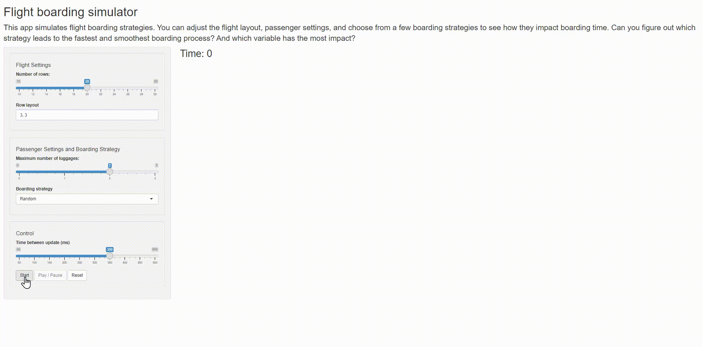

## Flight boarding simulator

The repository contains a Shiny app that simulates flight boarding strategies. You can adjust the flight layout, passenger settings, and choose from a few boarding strategies to see how they impact boarding time. Can you figure out which strategy leads to the fastest and smoothest boarding process? And which variable has the most impact?


### Install dependencies and run the Shiny app

```{r}
install.packages(c("shiny", "shinyjs", "animate"))
# Use `remotes::install_github("kcf-jackson/animate")` for the development build.

shiny::runApp()
```


### Screenshots


